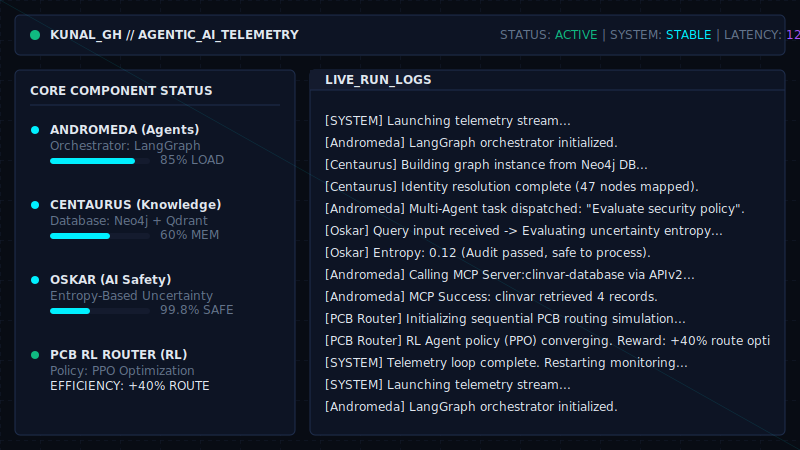

  

    

  

   

  

    
    
    
  

  
  

    👉 <b><a href="https://github.com/kunal-gh/kunal-gh/blob/main/Resume_Kunal.pdf">Click here to view my Resume with updated data on top</a></b>
  

  
  

    
  

---

### 🧬 About Me

  

---

### 🧠 Tech Stack

**🔤 Languages**  
   

**🤖 AI / ML / GenAI**  
      
> `RAG` • `GraphRAG` • `MCP` • `Multi-Agent Systems` • `Reinforcement Learning (PPO)`

**🌐 Web & Backend**  
  

**🗄️ Databases & Cloud**  
   

**⚙️ DevOps & AIOps**  
    
> `AI Observability` • `Model Monitoring` • `Drift Detection`

---

### 🚀 Technical Evolution & Featured Systems

| Phase | System / Project | Description | Core Tech |
|-------|-----------------|-------------|-----------|
| **Phase 5** *(Current)* | **ANDROMEDA** | Production-oriented enterprise agent platform for coordinating tools, retrieval workflows, and intelligent reasoning. | LangGraph, MCP, Multi-Agent |
| **Phase 5** | **CENTAURUS** | Enterprise knowledge worker platform transforming scattered information into structured organizational intelligence. | GraphRAG, Hybrid Retrieval, Neo4j |
| **Phase 4** | **OSKAR** | AI Safety system utilizing Entropy-Based Uncertainty Estimation for explainable moderation and human-in-the-loop workflows. | GNNs, GraphRAG, Transformers |
| **Phase 3** | **PCB Routing** | AI-powered PCB design platform treating routing as a sequential decision-making problem. Improved routing efficiency by ~40%. | Reinforcement Learning, PPO |
| **Phase 2** | **LeadGen Pro** | Predictive lead scoring platform integrated into operational decision-making processes. Achieved ~0.88 ROC-AUC. | XGBoost, Random Forest |

---

### 📊 System Telemetry

  
  

  

---

### ⏱️ Time Spent Processing (WakaTime Stats)

<!--START_SECTION:waka-->
<!--END_SECTION:waka-->

---

  <b>Open to collaborations on Agentic AI, Enterprise Knowledge Systems, and AI Safety.</b>  
  
  

