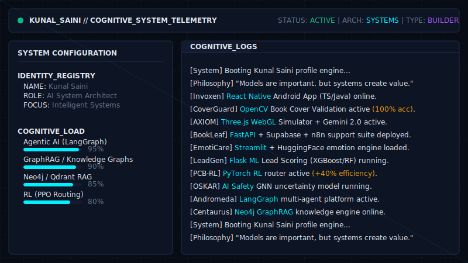

<div align="center">
  

  <br><br>

  [](https://git.io/typing-svg)

  <br>

  <p align="center">
    <a href="mailto:2112sainikunal@gmail.com"></a>
    <a href="https://www.linkedin.com/in/kunalsainii/"></a>
    <a href="https://github.com/kunal-gh/kunal-gh/blob/main/Resume_Kunal.pdf"></a>
  </p>
  
  <p align="center">
    
  </p>
</div>

---

### 🧬 About Me

<div align="center">
  
</div>

---

### 🧠 Tech Stack

**🔤 Languages**  
       

**🤖 AI / ML / GenAI & Computer Vision**  
       
> `LangGraph` • `Multi-Agent Systems` • `GraphRAG` • `Neo4j Knowledge Graphs` • `Reinforcement Learning (PPO)` • `XGBoost & Random Forest`

**🌐 Web, Mobile & Automation**  
       

**🗄️ Databases & Cloud**  
     

**⚙️ DevOps & AIOps**  
     
> `AI Observability` • `Model Monitoring` • `Drift Detection` • `Loom Telemetry`

---

### 🚀 Technical Evolution & Featured Systems

| Phase | System / Project | Description | Core Tech |
|-------|-----------------|-------------|-----------|
| **Phase 5**<br>*(Current)* | **ANDROMEDA** | Production-oriented enterprise agent platform for coordinating tools, retrieval workflows, and intelligent reasoning. | LangGraph, MCP, Multi-Agent |
| **Phase 5** | **CENTAURUS** | Enterprise knowledge worker platform transforming scattered information into structured organizational intelligence. | GraphRAG, Hybrid Retrieval, Neo4j |
| **Phase 5** | **Invoxen** | AI-powered financial management app for Android with professional invoice generation and sharing. | React Native, TypeScript, Java |
| **Phase 5** | **CoverGuard AI** | Industrial-grade book cover validation, spatial reasoning core, and image validation engine. | Python, FastAPI, React, OpenCV |
| **Phase 5** | **AXIOM Simulator** | Emergent systems simulator combining 3D WebGL renderers with supervised ML RF predictors. | Three.js, JavaScript, Python, Scikit-Learn, Gemini 2.0 |
| **Phase 5** | **BookLeaf Publishing** | Intelligent hybrid automation suite designed to streamline author support queries. | FastAPI, Supabase, OpenAI, N8N |
| **Phase 4** | **OSKAR** | AI Safety system utilizing Entropy-Based Uncertainty Estimation for explainable moderation and human-in-the-loop workflows. | GNNs, GraphRAG, Transformers |
| **Phase 4** | **EmotiCare AI** | Emotional wellness application detecting user emotion and sentiment via transformer networks. | Python, Streamlit, HuggingFace Transformers |
| **Phase 3** | **PCB Routing** | AI-powered PCB design platform treating routing as a sequential decision-making problem. Improved routing efficiency by ~40%. | Reinforcement Learning, PyTorch, PPO |
| **Phase 2** | **LeadGen Pro** | Predictive lead scoring platform integrated into operational decision-making processes. Achieved ~0.88 ROC-AUC. | XGBoost, Random Forest, Flask |

---

### 📊 System Telemetry

<div align="center">
  
  
</div>

<div align="center">
  
  
</div>

---

### ⏱️ Time Spent Processing (WakaTime Stats)

<!--START_SECTION:waka-->


**I'm an Early 🐤** 

```text
🌞 Morning                209 commits         ████████░░░░░░░░░░░░░░░░░   31.19 % 
🌆 Daytime                204 commits         ████████░░░░░░░░░░░░░░░░░   30.45 % 
🌃 Evening                237 commits         █████████░░░░░░░░░░░░░░░░   35.37 % 
🌙 Night                  20 commits          █░░░░░░░░░░░░░░░░░░░░░░░░   02.99 % 
```
📅 **I'm Most Productive on Wednesday** 

```text
Monday                   85 commits          ███░░░░░░░░░░░░░░░░░░░░░░   12.69 % 
Tuesday                  71 commits          ███░░░░░░░░░░░░░░░░░░░░░░   10.60 % 
Wednesday                158 commits         ██████░░░░░░░░░░░░░░░░░░░   23.58 % 
Thursday                 91 commits          ███░░░░░░░░░░░░░░░░░░░░░░   13.58 % 
Friday                   147 commits         █████░░░░░░░░░░░░░░░░░░░░   21.94 % 
Saturday                 46 commits          ██░░░░░░░░░░░░░░░░░░░░░░░   06.87 % 
Sunday                   72 commits          ███░░░░░░░░░░░░░░░░░░░░░░   10.75 % 
```


📊 **This Week I Spent My Time On** 

```text
🕑︎ Time Zone: Asia/Kolkata

💬 Programming Languages: 
No Activity Tracked This Week

🔥 Editors: 
No Activity Tracked This Week
```


 Last Updated on 29/06/2026 03:29:47 UTC
<!--END_SECTION:waka-->

---

<div align="center">
  <b>Open to collaborations on Agentic AI, Enterprise Knowledge Systems, and AI Safety.</b><br><br>
  <a href="https://www.linkedin.com/in/kunalsainii/"></a>
  <a href="mailto:2112sainikunal@gmail.com"></a>
</div>
